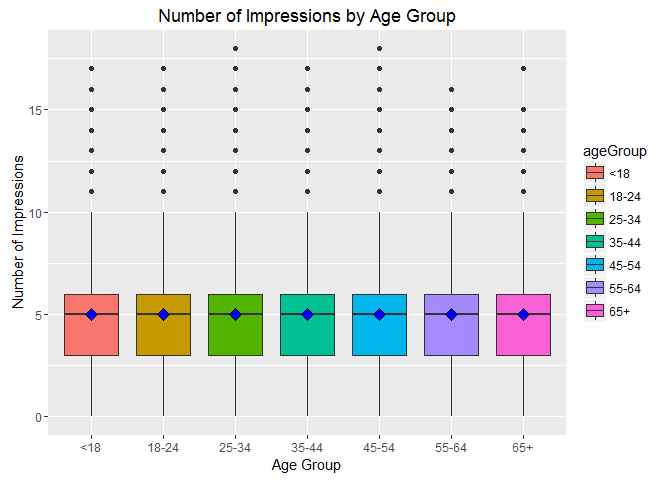
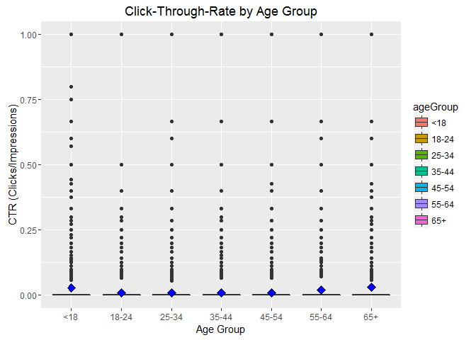
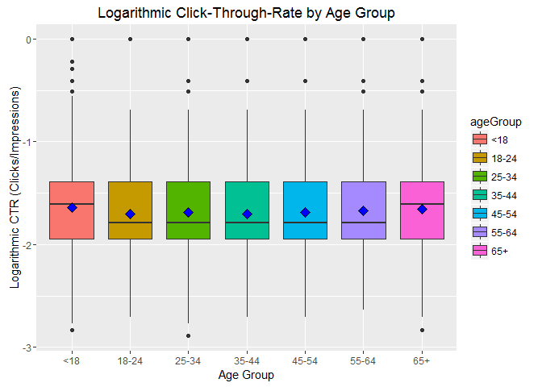
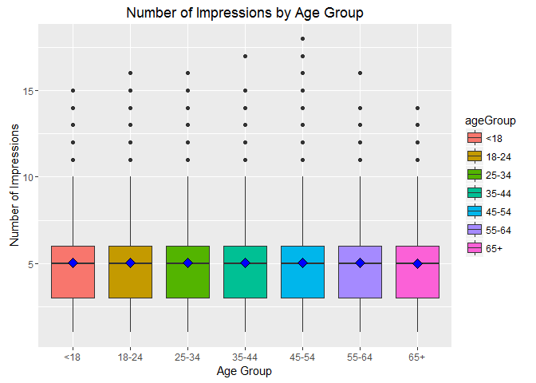
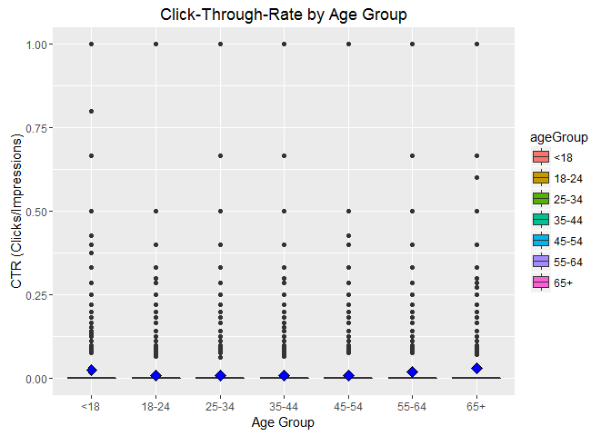
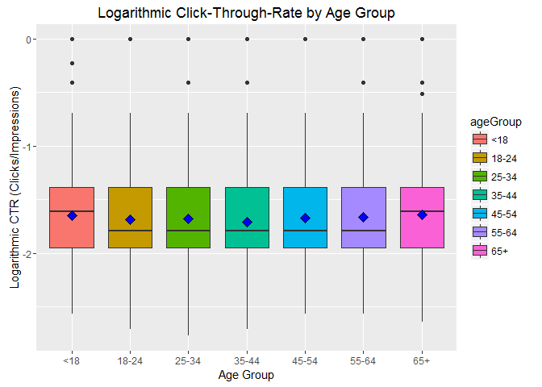

# LiveSessionAssignment-10
Rajni Goyal  
November 8, 2016  


##Unit 10 Live Session Prep Instructions:
#####•	Create a new variable ageGroup that categorizes age into following groups:< 18, 18–24, 25–34, 35–44, 45–54, 55–64 and 65+.
#####•	Use sub set of data called “ImpSub” where Impressions > 0 ) in your data set.
#####•	Create a new variable called click-through-rate (CTR = click/impression).
#####•	Use this ImpSub data set to do further analysis.
#####•	Plot distributions of number impressions and click-through-rate (CTR = click/impression) for the age groups.
#####•	Define a new variable to segment users based on click -through-rate (CTR) behavior-CTR< 0.2, 0.2<=CTR <0.4, 0.4<= CTR<0.6, 0.6<=CTR<0.8, CTR>0.8
#####•	Get the total number of Male, Impressions, Clicks and Signed_In (0=Female, 1=Male)
#####•	 Get the mean of Age, Impressions, Clicks, CTR and percentage of males and signed_In 
#####•	Get the means of Impressions, Clicks, CTR and percentage of males and signed_In  by AgeGroup.
#####•	Create a table of CTRGroup vs AgeGroup counts.
#####•	Plot distributions of number impressions and click-through-rate (CTR = click/impression) for the age groups
#####•	One more plot you think which is important to look at.

###Load libraries and data

```r
library(ggplot2)
library(doBy)
```

```
## Warning: package 'doBy' was built under R version 3.3.2
```

```r
library(caroline)
```

```
## Warning: package 'caroline' was built under R version 3.3.2
```
### Data obtained in zipped form from GitHub at https://github.com/oreillymedia/doing_data_science

```r
data1 <- read.csv(url("http://stat.columbia.edu/~rachel/datasets/nyt5.csv"))
head(data1)
```

```
##   Age Gender Impressions Clicks Signed_In
## 1  37      1           1      0         1
## 2  32      0           2      0         1
## 3   0      0           5      0         0
## 4  60      0           6      0         1
## 5  40      1           2      0         1
## 6  49      0           7      0         1
```
###Create age_group variable to categorize by ages < 18, 18-24, 25-34, 35-44, 45-54, 55-64 and 65+

```r
## Create age_group category
data1$ageGroup <-cut(data1$Age,c(-Inf,18,24,34,44,54,64,Inf))# Categorize users by "<18","18-24","25-34","35-44","45-54","55-64", and "65+"
head(data1)# Check to see that age_group categories added
```

```
##   Age Gender Impressions Clicks Signed_In  ageGroup
## 1  37      1           1      0         1   (34,44]
## 2  32      0           2      0         1   (24,34]
## 3   0      0           5      0         0 (-Inf,18]
## 4  60      0           6      0         1   (54,64]
## 5  40      1           2      0         1   (34,44]
## 6  49      0           7      0         1   (44,54]
```

```r
levels(data1$ageGroup) <- c("<18","18-24","25-34","35-44","45-54","55-64","65+") # Update category names (cut() created factor so we need to change the factor levels)
levels(data1$ageGroup)  # Confirm change
```

```
## [1] "<18"   "18-24" "25-34" "35-44" "45-54" "55-64" "65+"
```

```r
head(data1)
```

```
##   Age Gender Impressions Clicks Signed_In ageGroup
## 1  37      1           1      0         1    35-44
## 2  32      0           2      0         1    25-34
## 3   0      0           5      0         0      <18
## 4  60      0           6      0         1    55-64
## 5  40      1           2      0         1    35-44
## 6  49      0           7      0         1    45-54
```
###Plot Impressions by age_group for EDA

```r
## Explore Impressions by age_group
ggplot(data = data1, aes(x=ageGroup, y=Impressions, fill=ageGroup)) +
    geom_boxplot() + stat_summary(fun.y=mean, geom="point", shape=23, size=3, fill="blue") +     # Add blue mean diamond marker to boxplot
    xlab("Age Group") + ylab("Number of Impressions") + ggtitle("Number of Impressions by Age Group")
```

<!-- -->
## Add CTR column

```r
impsub<-subset(data1, Impressions>0)
head(impsub)
```

```
##   Age Gender Impressions Clicks Signed_In ageGroup
## 1  37      1           1      0         1    35-44
## 2  32      0           2      0         1    25-34
## 3   0      0           5      0         0      <18
## 4  60      0           6      0         1    55-64
## 5  40      1           2      0         1    35-44
## 6  49      0           7      0         1    45-54
```

```r
impsub$CTR <- impsub$Clicks/impsub$Impressions
head(impsub)
```

```
##   Age Gender Impressions Clicks Signed_In ageGroup CTR
## 1  37      1           1      0         1    35-44   0
## 2  32      0           2      0         1    25-34   0
## 3   0      0           5      0         0      <18   0
## 4  60      0           6      0         1    55-64   0
## 5  40      1           2      0         1    35-44   0
## 6  49      0           7      0         1    45-54   0
```

```r
y=t(impsub$Gender)
ncol(y)
```

```
## [1] 367823
```

```r
y3=t(impsub$Signed_In)
ncol(y3)
```

```
## [1] 367823
```

```r
#CTR = data1$click/impsub
```
###Plot CTR for EDA

```r
ggplot(data =impsub, aes(x=ageGroup, y=CTR, fill=ageGroup)) +
    geom_boxplot() + stat_summary(fun.y=mean, geom="point", shape=23, size=3, fill="blue") +     # Add blue mean diamond marker to boxplot
    xlab("Age Group") + ylab("CTR (Clicks/Impressions)") + ggtitle("Click-Through-Rate by Age Group")
```

<!-- -->


###Plot log of CTR for EDA

```r
ggplot(data = impsub, aes(x=ageGroup, y=log(CTR), fill=ageGroup)) +
    geom_boxplot() + stat_summary(fun.y=mean, geom="point", shape=23, size=3, fill="blue") +     # Add blue mean diamond marker to boxplot
    xlab("Age Group") + ylab("Logarithmic CTR (Clicks/Impressions)") + ggtitle("Logarithmic Click-Through-Rate by Age Group") # Provide labels
```

```
## Warning: Removed 335803 rows containing non-finite values (stat_boxplot).
```

```
## Warning: Removed 335803 rows containing non-finite values (stat_summary).
```

<!-- -->
### Define a new variable to segment users based on click -through-rate (CTR) behavior

```r
impsub$CTRSeg <-cut(impsub$CTR,c(-Inf,0.2,0.4,0.6,0.8,Inf))
head(impsub)
```

```
##   Age Gender Impressions Clicks Signed_In ageGroup CTR     CTRSeg
## 1  37      1           1      0         1    35-44   0 (-Inf,0.2]
## 2  32      0           2      0         1    25-34   0 (-Inf,0.2]
## 3   0      0           5      0         0      <18   0 (-Inf,0.2]
## 4  60      0           6      0         1    55-64   0 (-Inf,0.2]
## 5  40      1           2      0         1    35-44   0 (-Inf,0.2]
## 6  49      0           7      0         1    45-54   0 (-Inf,0.2]
```

```r
levels(impsub$CTRSeg) <- c("CTR<0.2","0.2<=CTR<0.4","0.4<=CTR<0.6","0.6<=CTR<0.8","CTR>0.8") 
levels(impsub$CTRSeg)
```

```
## [1] "CTR<0.2"      "0.2<=CTR<0.4" "0.4<=CTR<0.6" "0.6<=CTR<0.8"
## [5] "CTR>0.8"
```
### Get the total number of Male, Impressions, Clicks and Signed_In

```r
head(impsub)
```

```
##   Age Gender Impressions Clicks Signed_In ageGroup CTR  CTRSeg
## 1  37      1           1      0         1    35-44   0 CTR<0.2
## 2  32      0           2      0         1    25-34   0 CTR<0.2
## 3   0      0           5      0         0      <18   0 CTR<0.2
## 4  60      0           6      0         1    55-64   0 CTR<0.2
## 5  40      1           2      0         1    35-44   0 CTR<0.2
## 6  49      0           7      0         1    45-54   0 CTR<0.2
```

```r
impsubMale<-subset(impsub, Gender>0)
head(impsubMale)
```

```
##    Age Gender Impressions Clicks Signed_In ageGroup CTR  CTRSeg
## 1   37      1           1      0         1    35-44   0 CTR<0.2
## 5   40      1           2      0         1    35-44   0 CTR<0.2
## 10  36      1          10      0         1    35-44   0 CTR<0.2
## 11  35      1           5      0         1    35-44   0 CTR<0.2
## 13  52      1           6      0         1    45-54   0 CTR<0.2
## 18  60      1           6      0         1    55-64   0 CTR<0.2
```

```r
x=t(impsubMale$Gender)
ncol(x)
```

```
## [1] 135484
```

```r
x1=t(impsubMale$Impressions)
ncol(x1)
```

```
## [1] 135484
```

```r
x2=t(impsubMale$Clicks)
ncol(x2)
```

```
## [1] 135484
```

```r
x3=t(impsubMale$Signed_In)
ncol(x3)
```

```
## [1] 135484
```

```r
pctMale<-(ncol(x)/ncol(y))*100
pctMale
```

```
## [1] 36.83402
```

```r
pctSigned<-(ncol(x3)/ncol(y3))*100
pctSigned
```

```
## [1] 36.83402
```
### Get the mean of Age, Impressions, Clicks, CTR and percentage of males and signed_In 

```r
sapply(impsubMale, mean, na.rm=TRUE)
```

```
## Warning in mean.default(X[[i]], ...): argument is not numeric or logical:
## returning NA

## Warning in mean.default(X[[i]], ...): argument is not numeric or logical:
## returning NA
```

```
##         Age      Gender Impressions      Clicks   Signed_In    ageGroup 
## 40.80982994  1.00000000  5.03024711  0.06915208  1.00000000          NA 
##         CTR      CTRSeg 
##  0.01377241          NA
```
### Get the means of Impressions, Clicks, CTR and percentage of males and signed_In  by AgeGroup.

```r
meanImp<-tapply(impsubMale$Impressions, impsubMale$ageGroup, mean, na.rm=TRUE) 
meanImp
```

```
##      <18    18-24    25-34    35-44    45-54    55-64      65+ 
## 5.027664 5.053617 5.027080 5.033793 5.036652 5.019116 4.992527
```

```r
meanclicks<-tapply(impsubMale$Clicks, impsubMale$ageGroup, mean, na.rm=TRUE) 
meanclicks
```

```
##        <18      18-24      25-34      35-44      45-54      55-64 
## 0.13410845 0.04886896 0.04914904 0.05005821 0.05094175 0.09521329 
##        65+ 
## 0.15658363
```

```r
meanCTR<-tapply(impsubMale$CTR, impsubMale$ageGroup, mean, na.rm=TRUE) 
meanCTR
```

```
##         <18       18-24       25-34       35-44       45-54       55-64 
## 0.026362186 0.009683503 0.009848637 0.009684971 0.010293378 0.019344307 
##         65+ 
## 0.031169982
```

```r
meanMale<-tapply(impsubMale$Gender, impsubMale$ageGroup, sum, na.rm=TRUE) 
meanMale
```

```
##   <18 18-24 25-34 35-44 45-54 55-64   65+ 
##  9977 15163 25148 30065 27502 19199  8430
```

```r
meanMalepct<-as.data.frame(meanMale)
meanMalepct1<-meanMalepct/ncol(x)*100
meanMalepct1
```

```
##        meanMale
## <18    7.363969
## 18-24 11.191727
## 25-34 18.561601
## 35-44 22.190812
## 45-54 20.299076
## 55-64 14.170677
## 65+    6.222137
```

```r
meanSigned<-tapply(impsubMale$Signed_In, impsubMale$ageGroup, sum, na.rm=TRUE) 
meanSigned
```

```
##   <18 18-24 25-34 35-44 45-54 55-64   65+ 
##  9977 15163 25148 30065 27502 19199  8430
```

```r
meanSignedpct<-as.data.frame(meanSigned)
meanSignedpct1<-meanSignedpct/ncol(x3)*100
meanSignedpct1
```

```
##       meanSigned
## <18     7.363969
## 18-24  11.191727
## 25-34  18.561601
## 35-44  22.190812
## 45-54  20.299076
## 55-64  14.170677
## 65+     6.222137
```
### Create a table of CTRGroup vs AgeGroup counts

```r
clen <- function(x){c(length(x))}
etable1<-summaryBy(CTRSeg~ageGroup,data = impsubMale, FUN=clen)
etable1
```

```
##   ageGroup CTRSeg.clen
## 1      <18        9977
## 2    18-24       15163
## 3    25-34       25148
## 4    35-44       30065
## 5    45-54       27502
## 6    55-64       19199
## 7      65+        8430
```

```r
etable2<-summaryBy(ageGroup~CTRSeg,data = impsubMale, FUN=clen)
etable2
```

```
##         CTRSeg ageGroup.clen
## 1      CTR<0.2        132684
## 2 0.2<=CTR<0.4          2381
## 3 0.4<=CTR<0.6           344
## 4 0.6<=CTR<0.8            18
## 5      CTR>0.8            57
```
###Plot Impressions by age_group for EDA

```r
ggplot(data = impsubMale, aes(x=ageGroup, y=Impressions, fill=ageGroup)) +
    geom_boxplot() + stat_summary(fun.y=mean, geom="point", shape=23, size=3, fill="blue") +     # Add blue mean diamond marker to boxplot
    xlab("Age Group") + ylab("Number of Impressions") + ggtitle("Number of Impressions by Age Group")
```

<!-- -->
###Plot CTR for EDA

```r
ggplot(data =impsubMale, aes(x=ageGroup, y=CTR, fill=ageGroup)) +
    geom_boxplot() + stat_summary(fun.y=mean, geom="point", shape=23, size=3, fill="blue") +     # Add blue mean diamond marker to boxplot
    xlab("Age Group") + ylab("CTR (Clicks/Impressions)") + ggtitle("Click-Through-Rate by Age Group")
```

<!-- -->


###Plot log of CTR for EDA

```r
ggplot(data = impsubMale, aes(x=ageGroup, y=log(CTR), fill=ageGroup)) +
    geom_boxplot() + stat_summary(fun.y=mean, geom="point", shape=23, size=3, fill="blue") +     # Add blue mean diamond marker to boxplot
    xlab("Age Group") + ylab("Logarithmic CTR (Clicks/Impressions)") + ggtitle("Logarithmic Click-Through-Rate by Age Group") # Provide labels
```

```
## Warning: Removed 126516 rows containing non-finite values (stat_boxplot).
```

```
## Warning: Removed 126516 rows containing non-finite values (stat_summary).
```

<!-- -->
